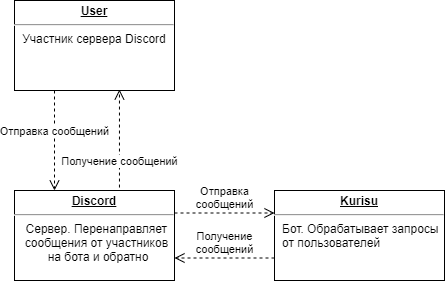
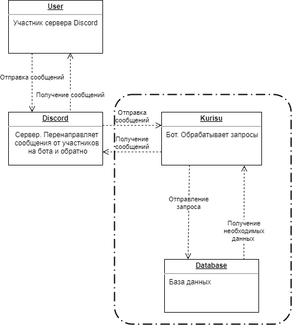

# Salieri Core
##### Модификация в рамках курсового проекта по дисциплине Конструирование ПО (3530904/8010#)

## Участники
- Чижов Н.В. /80101
- Поддубный А.А. /80105
- Распереза А.Д. /80105

## Этапы
### 1. Определение проблемы
Необходимо разработать Discord-бота для выполнения роли ассистента, обеспечивающего помощь в модерировании на сервере, а также реализующего функционал, необходимый пользователям на сервере игроков в настольные ролевые игры.

### 2. Выработка требований
- Приложение должно отправлять в текстовый канал Discord сервера анонсы, заложенные в бота, в определенные даты;
- Приложение должно иметь функцию поисковика по базе данных;
- Приложение должно формировать статистику по активности участников на сервере и выводить по запросу;
- Приложение должно иметь модульную структуру, подключение и отладка которых возможно воспроизводить в процессе работы;
- Приложение должно иметь вспомогательные функции для проведения настольных ролевых игр, в частности, броски игральных костей различного количества граней, хранение игровых характеристик персонажей.

### 3. Разработка архитектуры и детальное проектирование

### 4. Кодирование и отладка
Это довольно старый проект одного из участников. В рамках курсового проекта он был исправлен и были добавлены тесты. Также вырезана часть функционала.

### 5. Unit тестирование
В рамках работы создано три Unit-теста в пакете salieri/units:
- tips:
    Проверяет правильность выбора термина из базы при точном и неточном выборе;
- nyaa:
    Проверяет правильность выбора эпизода из базы данных по номеру;
- embeds:
    Проверяет правильность экземпляров Embed-сообщений, созданных модулем kurisu/prefs.

### 6. Интеграционное тестирование
В рамках данного этапа создано два теста в пакете salieri/integrations:
- tips:
    Проверяет правильность выбора термина и формирования Embed-сообщения;
- info:
    Проверяет правильность формирования Embed-сообщения на основе проедустановленного ложного экземпляра класса пользователя.

### 7. Сборка
##### Необходимые модули:
- discord.py - фреймворк для работы с Discord из Python
- lxml - модуль для работы с XML
- aiofiles - модуль поддержки файлов в `asyncio`
- psutil - модуль для работы с `ps`

##### Команды (считается, что выполняются в SalieriCore):
Загрузка всех зависимостей: `python3 -m pip install -r requirements.txt` 
Запустить юнит тесты: `cd Kurisu && python3 unit_tests.py` 
Запустить интеграционные тесты: `cd Kurisu && python3 integration_tests.py` 
Запустить бота: `cd Kurisu && python3 main.py` (необходим токен)